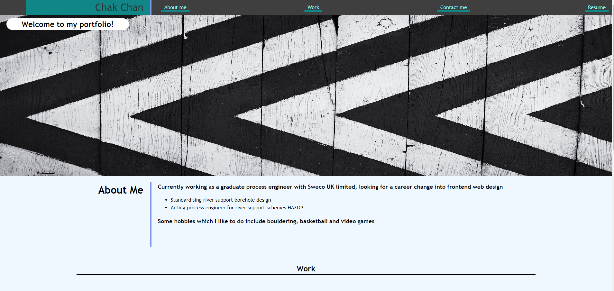
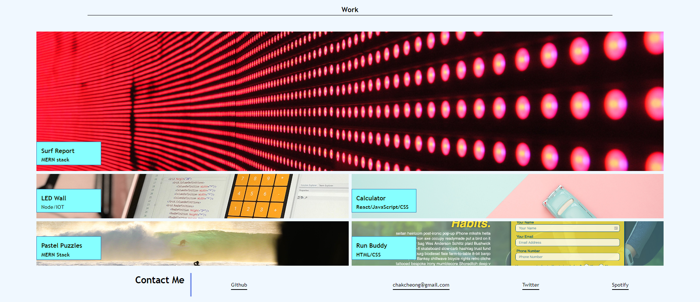

# Chak Chan Web Desginer Portfolio

## Description 

A website to showcase my best projects and a short section of about me

## Table of Contents (Optional)

* [Installation](#installation)
* [Usage](#usage)
* [Credits](#credits)
* [License](#license)

## Installation

N/A

## Usage 

Each section on the header is provided with a link which redirect the user to the content below, there is also a side bar which describe all the addtional benefit

Link to application: https://github.com/ccc7321/web_design_portfolio

## Credits

Credits to Omar as the instructor of this course

## License

Please refer to licence in the repo.

